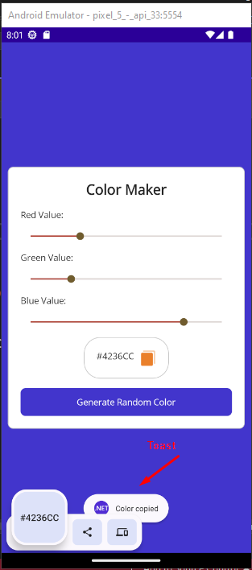

# https://www.udemy.com/course/curso-net-maui/

## Especificando colores para el uso de una ContentPage

* Aprendiendo a establecer recursos y utilizarlos en otro lugar
```xml
<ContentPage.Resources>
    <Color x:Key="Primary">#ab3527</Color>
    <Color x:Key="Secondary">#775752</Color>
    <Color x:Key="Tertiary">#705c2e</Color>
</ContentPage.Resources>

<Button BackgroundColor="{StaticResource Secondary}"/>
```

* Estableciendo el Layout que vamos a utilizar para la aplicacion

```xml
 <Grid x:Name="Container" BackgroundColor="Black">
     
 </Grid>
```

* Hay que crear la seccion donde se mostraran los diferentes controles

* Instalamos el paquete `CommunityToolkit.Maui.Core` para
poder hacer el copiado de la cadena hexadecimal

* Codigo XAML
```xml
<?xml version="1.0" encoding="utf-8" ?>
<ContentPage xmlns="http://schemas.microsoft.com/dotnet/2021/maui"
             xmlns:x="http://schemas.microsoft.com/winfx/2009/xaml"
             x:Class="ColorMaker.MainPage">

    <ContentPage.Resources>
        <Color x:Key="Primary">#ab3527</Color>
        <Color x:Key="Secondary">#775752</Color>
        <Color x:Key="Tertiary">#705c2e</Color>
    </ContentPage.Resources>

    <Grid x:Name="Container" BackgroundColor="Black">
        <Frame Margin="10, 0, 10, 0" VerticalOptions="Center">
            <VerticalStackLayout Spacing="15" VerticalOptions="Center">
                <Label FontAttributes="Bold"
                       FontSize="Large"
                       HorizontalTextAlignment="Center"
                       Text="Color Maker"
                       />
                <Label Text="Red Value:"/>
                <Slider x:Name="sldRed"
                        ThumbColor="{StaticResource Tertiary}"
                        MaximumTrackColor="{StaticResource Secondary}"
                        MinimumTrackColor="{StaticResource Primary}"
                        ValueChanged="Slider_ValueChanged"/>

                <Label Text="Green Value:"/>
                <Slider x:Name="sldGreen"
                        ThumbColor="{StaticResource Tertiary}"
                        MaximumTrackColor="{StaticResource Secondary}"
                        MinimumTrackColor="{StaticResource Primary}"
                        ValueChanged="Slider_ValueChanged"/>

                <Label Text="Blue Value:"/>
                <Slider x:Name="sldBlue"
                        ThumbColor="{StaticResource Tertiary}"
                        MaximumTrackColor="{StaticResource Secondary}"
                        MinimumTrackColor="{StaticResource Primary}"
                        ValueChanged="Slider_ValueChanged"/>
                <Frame CornerRadius="25"
                       HorizontalOptions="Center">
                    <HorizontalStackLayout>
                        <Label x:Name="lblHex"
                               HorizontalTextAlignment="End"
                               Text="Hex Value: #000000"
                               VerticalOptions="Start"/>
                        <ImageButton Margin="10, 0, 0, 0"
                                     HeightRequest="25"
                                     Source="copy.svg"
                                     VerticalOptions="End"
                                     WidthRequest="25"
                                     Clicked="ImageButton_Clicked"/>
                    </HorizontalStackLayout>
                </Frame>
                <Button x:Name="btnRandom"
                        BackgroundColor="{StaticResource Primary}"
                        Text="Generate Random Color"
                        Clicked="btnRandom_Clicked"/>
            </VerticalStackLayout>
        </Frame>
    </Grid>
</ContentPage>
```
* Codigo C#
```c#
using CommunityToolkit.Maui.Alerts;

public partial class MainPage : ContentPage
{
    private bool isRandom;
    private String hexValue;

    public MainPage()
    {
        InitializeComponent();
    }

    private void Slider_ValueChanged(object sender, ValueChangedEventArgs e)
    {
        if (
            isRandom == false
            )
        {
            var red = sldRed.Value;
            var green = sldGreen.Value;
            var blue = sldBlue.Value;

            Color color = Color.FromRgb(red, green, blue);

            SetColor(color);
        }
    }

    private void SetColor(Color color)
    {
        btnRandom.BackgroundColor = color;
        Container.BackgroundColor = color;
        hexValue = color.ToHex();
        lblHex.Text = hexValue;
    }

    private void btnRandom_Clicked(object sender, EventArgs e)
    {
        isRandom = true;

        var random = new Random();
        var color = Color.FromRgb(random.Next(0, 265),
            random.Next(0, 265),
            random.Next(0, 265));

        SetColor(color);
        sldRed.Value = color.Red;
        sldGreen.Value = color.Green;
        sldBlue.Value = color.Blue;
        isRandom = false;
    }

    private async void ImageButton_Clicked(object sender, EventArgs e)
    {
        await Clipboard.SetTextAsync(hexValue);
        var toast = Toast.Make("Color copied", CommunityToolkit.Maui.Core.ToastDuration.Short, 
            12);
        await toast.Show();
    }
}
```

* Resultado final



